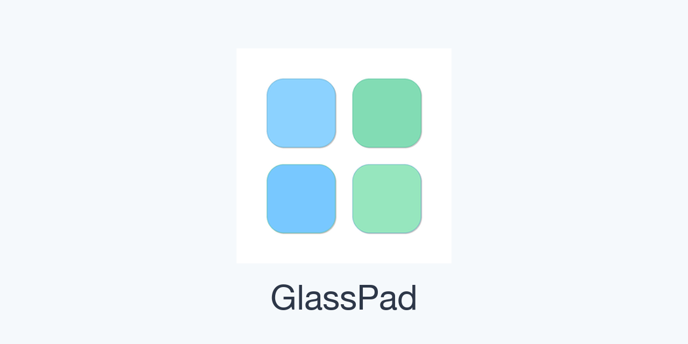

# GlassPad

macOS 原生 Launchpad 替代工具，采用 Liquid Glass 美学，全面支持无限屏画布、实时桌面壁纸捕获。

## 下载 / Download

- **官方站点（下载 / 更新日志 / Pro 激活验证）：[glasspad.pocketbay.app](https://glasspad.pocketbay.app/)**
- **最新内测版：v1.0.133** —— 请通过[官网报名](https://glasspad.pocketbay.app/)获取专属内测密钥与下载链接；本仓库为**公开引流页**，仅作版本标记与项目介绍；下载 / 更新统一走官网 glasspad.pocketbay.app，Release 不再附安装包。
- 所有版本见 [Releases](https://github.com/anson55sky/GlassPad-releases/releases)

## 安装 / Install

1. 下载后双击 `.dmg`，将 **GlassPad** 拖入「应用程序」。
2. 首次打开若被 Gatekeeper 拦截：右键 App →「打开」，或在 **系统设置 → 隐私与安全性** 中点击「仍要打开」。
   （当前为内测构建，使用 ad-hoc 签名、尚未公证 Notarize，属正常提示。）
3. **壁纸权限说明**：静态图片壁纸无需任何权限；动态/Aerials 壁纸的高保真实时捕获可能需要「完全磁盘访问」，未授权时自动降级为系统资源，不会空白。

## 自动更新 / Auto-update

- **内测分发版（1.0.133/）**：读取官网私有更新源 `glasspad.pocketbay.app/api/beta/update`，新版本推送不依赖本仓库。
- 也可在设置中手动「检查更新」。

## 许可与发布策略 / License & Distribution

- 当前为 **内测版（Open Beta）**，**全部功能免费**。
- 后续将进入「试用期 + 激活」阶段（详见源码库 README）。
- **源码**位于私有库 [`anson55sky/GlassPad`](https://github.com/anson55sky/GlassPad)（不公开）；本仓库仅用于**版本存档**，下载与更新已收敛到实网。

## 反馈 / Feedback

- 内测用户：App 内 **设置 → 关于 → 提交反馈**（自动附带密钥）。
- 也可通过本仓库 Issues 反馈问题或建议。
